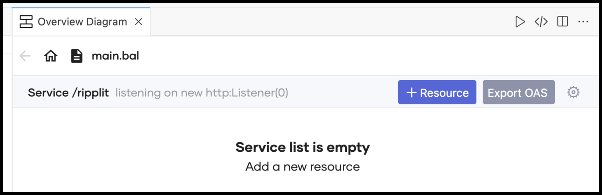
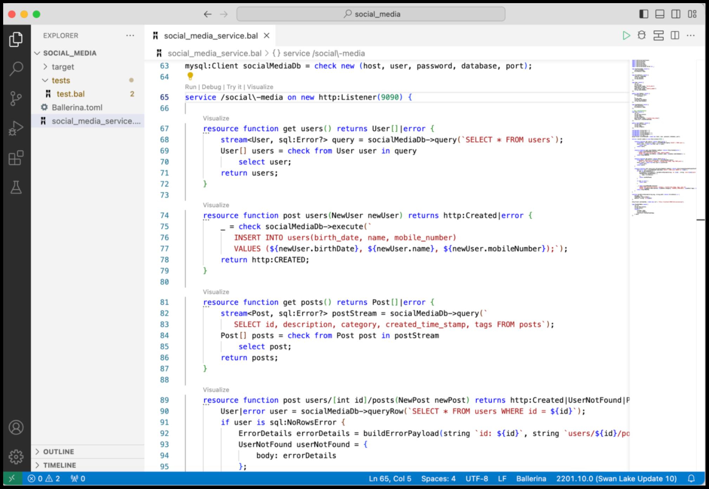

# [Ballerina] Ripplit Social Media Service

__Authors__: Shafreen, Ayesh  
__Reviewers__: [Yet to fill in]  
__Duration__: 45 mins

## Goal
- Introduce the Ballerina pro-code experience to someone unfamiliar with Ballerina
- Spark enough curiosity in the listener's mind so that, when the need arises, they will consider trying out Ballerina

## Audience
- Anyone with technical expertise in the integration space who is seeking a pro-code solution

## Prerequisite 
- Docker with `docker compose`
- VS Code with Dev Containers extension
    - After creating the project, copy the `.devcontainer.json` file from the `ripplit_service` in the main branch.
- If not using the Dev Container option:
    1. Install Ballerina.
    2. Run the following commands:
        ```bash
        code --install-extension wso2.ballerina
        code --install-extension humao.rest-client
        code --install-extension be5invis.toml
        code --install-extension cweijan.vscode-mysql-client2
        ```
    3. Enable experintal featuers in Ballerina VS Code extension.

## Overview

This document is designed to explain the demo script for a social media service built using Ballerina. It is tailored for individuals who may be unfamiliar with Ballerina, making it a great resource to get a hands-on look and feel of the language.

The demo is structured to guide users through both the concepts and practical aspects of Ballerina, with a slide deck introducing core concepts, followed by code examples that reinforce the key points from the slides. The demo covers the "why," "what," and "when" of Ballerina, offering a comprehensive introduction to the language.

Key topics included in the demo:

- Writing services in Ballerina
- Running and testing code
- Deploying services
- Enabling observability features
- Setting up CI/CD pipelines

This demo serves as a complete walkthrough for anyone looking to explore Ballerina's capabilities, from service creation to deployment and monitoring.

## Description

The sample is based on a simple API written for a social media site (like Twitter) that includes users, associated posts, and followers. Below is the high-level component diagram.


As you can see in the image, this service connects two main endpoints: one is a MySQL endpoint, and the other is an HTTP endpoint. The following is the entity relationship diagram that describes the tables in the database.


Following is the service description.

```ballerina
type Ripplit service object {
    *http:Service;

    // users resource
    resource function get users() returns User[]|error;
    resource function get users/[int id]() returns User|UserNotFound|error;
    resource function post users(NewUser newUser) returns http:Created|error;
    resource function delete users/[int id]() returns http:NoContent|error;

    // posts resource
    resource function get posts() returns PostWithMeta[]|error;
    resource function get users/[int id]/posts() returns PostMeta[]|UserNotFound|error;
    resource function post users/[int id]/posts(NewPost newPost) returns http:Created|UserNotFound|PostForbidden|error;
};
```

Key featurs that are covered by this scenario are as follows.

- Writing REST APIs with verbs, URLs, data binding and status codes
- Accessing databases
- Configurability
- Debugging Ballerina programs
- HTTP client
- Handling errors
- Writing a simple testcase
- Deploying in Docker and Kubernetes


## Setup Environment

1. Checkout the code base and move to the environment folder
2. Execute `docker compose up`

Note that the environment includes a simple web application. Below is a sample image.


You can use it to show the final outcome. However, during the demo, it might be easier to use the REST Client file in the client folder to try out the service. See the `Try Out` section for more details.

Additionally, it connects to multiple supportive services, such as Integration Control Plane (ICP), Jaeger, Prometheus, and Grafana. The relevant links for each service are as follows:

- Graphana: http://localhost:3000/dashboard
- Prometheus: http://localhost:9090
- Jaeger: http://localhost:16686/
- ICP: https://localhost:9743/login
- Frontend: http://localhost:3001/

## Start the Ripplit Service

To start the social media service go to `ripplit_service` Ballerina project and execute `bal run`.

## Try Out

- To send request open `ripplit-request.http` file in client folder using VS Code with `REST Client` extension
- To open the frontend type `http://localhost:3001` in the browser

## CI/CD

The `cicd` folder includes a sample pipeline for github workflows.

## Slides

The following link includes the slides and the recording of the presentation. Please note that the links are private.

- [Slides](https://docs.google.com/presentation/d/1msv4GqDAQtgBVJjAG_CnZb6wSbmhcB15Z68fWuOOYwQ/edit?usp=sharing)
- [Recording](https://drive.google.com/file/d/18kqcwjWSEGxi76KA9TKHbu9FKuP_IsF5/view?usp=sharing)

## Step by Step Guide For The Demo

### Setting up the project and adding the initial implementation

1. Navigate to the the folder you want to create the project  
2. Execute the below command

```
bal new ripplit_service
```

3. Start VS code by executing the the below command

```
code ripplit_service
```

4. In the main.bal delete all the code and create a new `http:Service` as follows


5. Click on visualize code lens and add a new resource using the `+ Resource` button

6. Add the first resource method to list available users.



7. Create the first Ballerina resource with the path users and the return value as User type  


8. Add some fields to the User record as follows

```ballerina
type User record {
   int id;
   string name;
   string mobileNumber;
   time:Date brithDate;
};
```

9. Now in the body of resources just create a mock value and return

```ballerina
service on new http:Listener(0) {

   resource function get users() returns User {
       User user = {id: 1, name: "John", mobileNumber: "0771234567", brithDate: {year: 1990, month: 5, day: 15}};
       return user;
   }
}
```

10.  Give a port number to the listener as 9090  
11. Run the code using the Run code lens.


12. Try it using the in-built try it code lens as follows.  


      
13. Now lets add a new resource for a post request using the same API designer UI


14. Fill in NewUser type with below fields 

```ballerina
type NewUser record {
   string name;
   string mobileNumber;
   time:Date brithDate;
};
```

15. Now let's fill in the body of the new resource function as below.

```ballerina
resource function post users(NewUser newUser) returns http:Created {
    log:printInfo("New user added: " + newUser.name);
    return http:CREATED;
}
```

16.  Run the service and Try it with the try it lens as the earlier 

### Integrating a MySQL database

#### Import the `mysql:Client` to the project

1. Go to the diagram view and click on the `+ Component` button.


2. Click on `Connector` from the drop down menu.


3. Search for `mysql` in the search bar and click on `mysql:Client` icon.


4. Change the variable name and select the necessary parameters and click on `Save`.


#### Update `Get User` resource

1. Import \`ballerina/sql` package to the project (add the relevant import statement).

```ballerina
import ballerina/sql;
```

2. Update the `User` record with relevant SQL annotations to map the record to a MySQL table.

```ballerina
type User record {|
    int id;
    string name;
    @sql:Column {
        name: "birth_date"
    }
    time:Date birthDate;
    @sql:Column {
        name: "mobile_number"
    }
    string mobileNumber;
|};
```

3. Use `mysql:Client` to retrieve users from the database and update the `Get user` resource.

```ballerina
resource function get users() returns User[]|error {
    stream<User, sql:Error?> query = ripplitDb->query(`SELECT * FROM users`);
    User[] users = check from User user in query select user;
    return users;
}
```

#### Update `Create User` resource

1. Use `mysql:Client` to insert a record into the database.

```ballerina
resource function post users(NewUser newUser) returns http:Created|error {
    _ = check ripplitDb->execute(`INSERT INTO users(birth_date, name, mobile_number) 
            VALUES (${newUser.birthDate}, ${newUser.name}, ${newUser.mobileNumber});`);
    return http:CREATED;
}
```

#### Externalizing `mysql:Client` configurations

1. Add configurations required for the `mysql:Client` as configurables.

```ballerina
configurable string host = ?;
configurable string user = ?;
configurable string password = ?;
configurable string database = ?;
configurable int port = ?;
```

2. Use the defined configurations in the `mysql:Client` init.

```ballerina
mysql:Client ripplitDb = check new (host, user, password, database, port);
```

3. Add a `Config.toml` to the project and add the values relevant to `mysql:Client` configurations.

```ballerina
host = "localhost"
user = "dummyuser"
password = "dummypassword"
database = "ripplit_db"
port = 3306
```

### Connecting to an external REST endpoint

1. At this point the code (ripplit\_service HTTP service) should have the following structure. This completed code can be found in the `master` or `main` branch of the project hence at this point we have to switch the git branch.

```ballerina
service /ripplit on new http:Listener(9090) {

   resource function get users() returns User[]|error {
        stream<User, sql:Error?> query = ripplitDb->query(`SELECT * FROM users`);
        User[] users = check from User user in query select user;
        return users;
   }

   resource function post users(NewUser newUser) returns http:Created|error {
       _ = check ripplitDb->execute(`
           INSERT INTO users(birth_date, name, mobile_number)
           VALUES (${newUser.birthDate}, ${newUser.name}, ${newUser.mobileNumber});`);
       return http:CREATED;
   }
  
   resource function get posts() returns Post[]|error {
       stream<Post, sql:Error?> postStream = ripplitDb->query(`
           SELECT id, description, category, created_time_stamp, tags FROM posts`);
       Post[] posts = check from Post post in postStream select post;
       return posts;
   }

    resource function post users/[int id]/posts(NewPost newPost) returns http:Created|UserNotFound|PostForbidden|error {
        User|error user = ripplitDb->queryRow(`SELECT * FROM users WHERE id = ${id}`);
        if user is sql:NoRowsError {
            ErrorDetails errorDetails = buildErrorPayload(string `id: ${id}`, string `users/${id}/posts`);
            UserNotFound userNotFound = {
                body: errorDetails
            };
            return userNotFound;
        }

        if user is error {
            return user;
        }

        _ = check ripplitDb->execute(`
            INSERT INTO posts(description, category, created_time_stamp, tags, user_id)
            VALUES (${newPost.description}, ${newPost.category}, CURRENT_TIMESTAMP(), ${newPost.tags}, ${id});`);
        return http:CREATED;
    }
}
```

2. Follow the steps we used to import the `mysql:Client` and search for ‘http’ in the connector search bar and select `http:Client`.


3. Update the relevant configurations and click on `Save`.


4. To databind the response payload retrieved from the sentiment-endpoint add the following records.

```ballerina
type Probability record {
    decimal neg;
    decimal neutral;
    decimal pos;
};

type Sentiment record {
    Probability probability;
    string label;
};
```

5. Update the `Create Post` resource by introducing the sentiment analysis logic.

```ballerina
resource function post users/[int id]/posts(NewPost newPost) returns http:Created|UserNotFound|PostForbidden|error {
    User|error user = ripplitDb->queryRow(`SELECT * FROM users WHERE id = ${id}`);

    if user is sql:NoRowsError {
  	  return http:NOT_FOUND;
    }

    if user is error {
  	  return user;
    }

    Sentiment sentiment = check sentimentEp->/api/sentiment.post({ "text": newPost.description });
    if sentiment.label == "neg" {
  	  return http:FORBIDDEN;
    }

    _ = check ripplitDb->execute(
        `INSERT INTO posts(description, category, created_time_stamp, tags, user_id) VALUES (${newPost.description}, ${newPost.category}, CURRENT_TIMESTAMP(), ${newPost.tags}, ${id});`);
    return http:CREATED;
}
```

### Using Ballerina Data Mapper

1. Go to the Diagram view and click on the `+ Component` button.


2. Click on `Data Mapper` from the menu.


3. Update the name, and input types. Then click on `Create Record` in the `Output Type` section.


4. Select `+ Create New` from the options.


5. Update relevant record information and click on `Save`.


6. Do the basic data-mapping by simply mapping the relevant field using UI.


7. To map the `tags` field, click on the link between the source-field and the target-field (one colored in red) and click on `< >` icon.


8. Go into the editor view and edit the mapping and click `Save`.


9. The generated data-mapper function would look like the following.

```ballerina
function mapPostToPostWithMeta(Post post, string author) returns PostWithMeta => {
    id: post.id,
    description: post.description,
    author,
    meta: {
        tags: re `,`.split(post.tags),
        category: post.category,
        createdTimeStamp: post.createdTimeStamp
    }
};
```

10. Update the `Get Posts` resource to return `PostWithMeta` record, and update the relevant logic.

```ballerina
resource function get posts() returns PostWithMeta[]|error {
        stream<User, sql:Error?> userStream = ripplitDb->query(`SELECT * FROM users`);
    PostWithMeta[] posts = [];
    User[] users = check from User user in userStream select user;

    foreach User user in users {
            stream<Post, sql:Error?> postStream = ripplitDb->query(`SELECT id, description, category, created_time_stamp, tags FROM posts WHERE user_id = ${user.id}`);
        Post[] userPosts = check from Post post in postStream select post;
            
        foreach Post post in userPosts {
            PostWithMeta postsWithMeta = mapPostToPostWithMeta(post, user.name);
      	  posts.push(postsWithMeta);
  	  }
    }
    return posts;
}
```

### Generating tests using Ballerina copilot

1. Click on `service` keyword in the service declaration. Then a bulb-icon will appear on top of that.


2. Click on the bulb-icon and from the dropdown menu select `Generate unit tests with copilot`.


3. The generated tests could be found in the `tests` directory.



### Generate Build Artifacts

1. Go into the `ripplit\_service` directory and build the project.

```
bal build
```

2. Run the generated executable JAR (uber JAR) file.

```
bal run target/bin/ripplitsvc.jar
```

### Ballerina Observability

1. To access Jaeger UI go to the [http://localhost:16686](http://localhost:16686) on your browser.  
2. To access Grafana UI go to the [http://localhost:3000](http://localhost:3000) on your browser.
